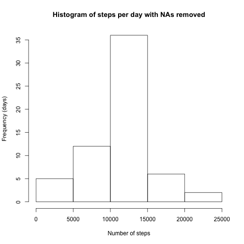

## Loading and preprocessing the data
Load the data with read.csv

```r
data <- read.csv('activity.csv')
```

Convert the dates in to R internal date format for further processing

```r
data$date <- as.Date(data$date)
```


## What is mean total number of steps taken per day?
Compute the mean per day

```r
steps_per_day <- aggregate(data$steps, list(data$date), sum)
```

Plot the histogram

```r
hist(steps_per_day$x, xlab='Number of steps', ylab='Frequency (days)', main='Histogram of steps per day')
```

 

Calculate the mean and median of the total number of steps taken per day

```r
steps_mean <- mean(steps_per_day$x,na.rm = TRUE)
steps_median  <- median(steps_per_day$x,na.rm = TRUE)
```
The mean is 10766.2 steps per day and median is 10765 steps per day

## What is the average daily activity pattern?
Calculate and plot the average steps for each interval of the day. Append that to data for later use

```r
steps_per_interval <- aggregate(data$steps, list(data$interval), mean, na.rm=TRUE)
data = merge(data,steps_per_interval,by.x='interval',by.y='Group.1')
with(steps_per_interval, plot(Group.1, x, xlab = 'Interval',ylab = 'mean',type='l'))
```

 

Find the interval that contains the most steps

```r
max_location <- which.max(steps_per_interval$x)
max_interval_interval <- steps_per_interval$Group.1[max_location]
max_interval_steps <- steps_per_interval$x[max_location]
```

The interval that contains the most average steps is interval located at 835, with 206.17 steps on average

## Imputing missing values
First, calculate how many NAs are present

```r
nb_nas <- sum(is.na(data$steps))
```
There are 2304 NAs present.

Replace those NAs with the average for that interval

```r
steps_no_nas <- ifelse(is.na(data$steps),data$x,data$steps)
```

Create a new dataset that is equal to the original dataset but with the missing data filled in.

```r
data_no_nas <- data
data_no_nas$steps <- steps_no_nas
```

Compute the mean per day, make histogram of those steps, then report the mean and median of the total steps per day (as done previously)

```r
no_nas_steps_per_day <- aggregate(data_no_nas$steps, list(data_no_nas$date), sum)
hist(no_nas_steps_per_day$x, xlab='Number of steps', ylab='Frequency (days)', main='Histogram of steps per day with NAs removed')
```

 

```r
no_nas_steps_mean <- mean(no_nas_steps_per_day$x,na.rm = TRUE)
no_nas_steps_median  <- median(no_nas_steps_per_day$x,na.rm = TRUE)
```
The mean is 10766.2 steps per day and median is 10766.2 steps per day

Comparing this histogram with the previous and the means and medians, we see that there is very little difference between the statistics of the first dataset and the one where NAs were removed, but the histogram is much steeper.

## Are there differences in activity patterns between weekdays and weekends?
Create a new factor

```r
data_no_nas$weekday <- factor(ifelse(weekdays(as.Date(data$date)) %in% c('Saturday','Sunday'),'weekend','weekday'))
```

Compute steps per interval on weekdays and weekends (store in tmp value)

```r
tmp = aggregate(data_no_nas$steps,list(data_no_nas$interval,data_no_nas$weekday),mean)
```

Plot the distribution during weekdays vs weekends

```r
par(mar = rep(2, 4))
par(mfrow=c(2,1))
with(tmp[tmp['Group.2']=='weekend',], plot(Group.1, x, xlab = 'Interval',ylab = 'mean',type='l', main='Weekend'))
with(tmp[tmp['Group.2']=='weekday',], plot(Group.1, x, xlab = 'Interval',ylab = 'mean',type='l',main='Weekday'))
```

 

The distribution in weekdays vs weekend is clearly different.
